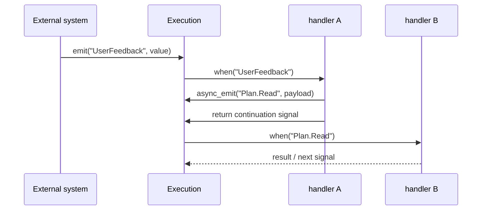

# Events, Signals, and External Injection

> Visualization boundary: Mermaid here explains event flow only. Exported config still requires named handlers and conditions.

TriggerFlow executes on “**signal arrives -> handler runs**”, not on “graph cursor moves from node to node”.

## 1. How internal and external events meet



### How to read this diagram

- External `execution.emit(...)` and internal `data.async_emit(...)` both flow into the same signal router.
- That is why TriggerFlow can handle both internal orchestration and open-world external events.

## 2. Common signal sources

- continuation signals after chunk completion
- explicit `emit()` / `async_emit()` inside a chunk
- external `execution.emit(...)`
- `runtime_data` signals from `set_runtime_data()`
- `flow_data` signals from `set_flow_data()`

## 3. `emit()` and `when()`

```python
from agently import TriggerFlow, TriggerFlowRuntimeData

flow = TriggerFlow()

@flow.chunk("planner")
async def planner(data: TriggerFlowRuntimeData):
    await data.async_emit("Plan.Read", {"task": "read"})
    await data.async_emit("Plan.Write", {"task": "write"})
    return "planned"

flow.to(planner).end()
flow.when("Plan.Read").to(lambda data: f"read:{data.value['task']}")
flow.when("Plan.Write").to(lambda data: f"write:{data.value['task']}")
```

## 4. `signal_info`

Inside handlers, you can inspect:

- `data.signal`
- `data.signal_id`
- `data.signal_source`
- `data.signal_meta`
- `data.signal_info`

This is especially useful for debugging, auditing, and resume logic.

## 5. Why `declare_emits()` matters

If a chunk emits business events that cannot be inferred from the static chain, declare them:

```python
chunk = flow.chunk("notify")(notify)
chunk.declare_emits("Alert", "ApprovalRequest")
```

This affects:

- Mermaid rendering
- static flow config export

## 6. Naming guidance

Recommended:

- `UserFeedback`
- `Approval.Granted`
- `Plan.Read`

Not recommended:

- making external systems depend directly on internal `Chunk[...]` triggers

Internal chunk triggers are runtime implementation details, not stable external protocol.
