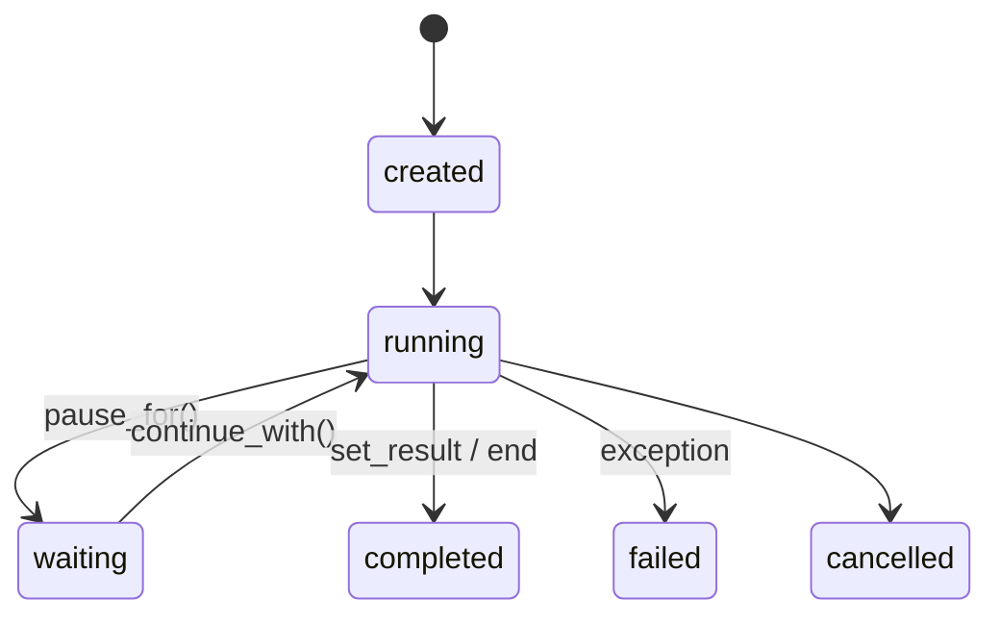
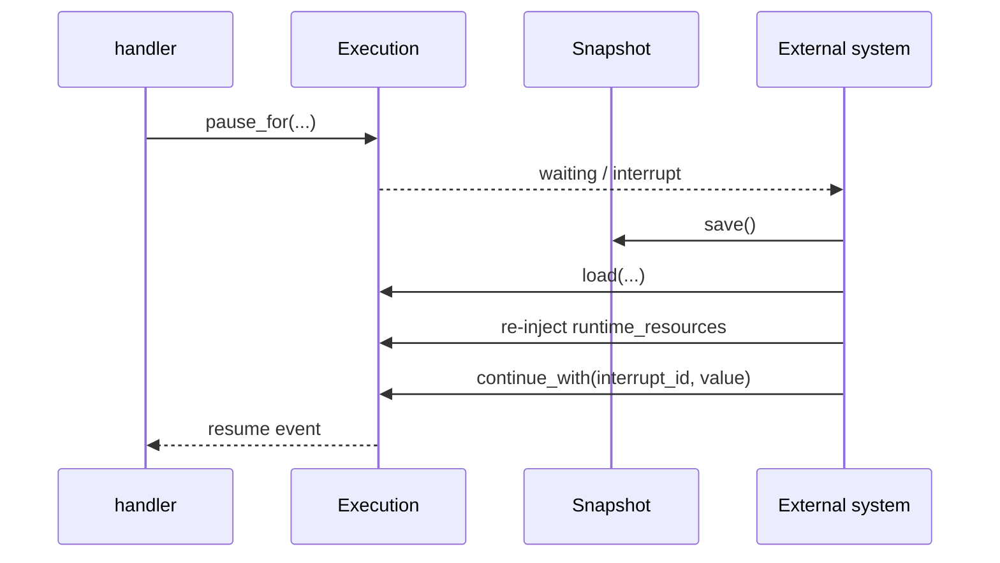

# Lifecycle, Pause/Resume, and Save/Load

> Visualization boundary: the state machine explains runtime semantics; exported config still requires named handlers and conditions.

## 1. Execution state machine



### How to read this diagram

- `cancelled` already exists as an explicit status constant, but there is no public `cancel()` API yet.
- `waiting` means “waiting for an external continuation”, not a blocked thread.

## 2. `start()` vs `start_execution()`

- `flow.start(...)`
  good for directly waiting for a result
- `flow.start_execution(..., wait_for_result=False)`
  better for long-lived executions

## 3. Pause, save, restore, continue



### Design rationale

- `save()` / `load()` restore workflow semantics, not the Python coroutine stack.
- The reliable recovery pattern is always “pause, persist, wait, continue with an external event”.

## 4. Interrupts and resume

```python
interrupt = await data.async_pause_for(
    type="human_input",
    payload={"question": "approve?"},
    resume_event="UserFeedback",
)
```

Later you can use:

- `get_interrupt(interrupt_id)`
- `get_pending_interrupts()`
- `continue_with(interrupt_id, value)`

to resume execution.

## 5. What `save()` stores

`save()` stores:

- `execution_id`
- `status`
- `runtime_data`
- `flow_data`
- `interrupts`
- `last_signal`
- `resource_keys`
- `result`

It does not store:

- runtime dependency objects themselves
- the Python coroutine stack

## 6. `get_last_signal()`

`last_signal` records the most recently dispatched signal and is useful for:

- debugging
- auditing
- locating the resume point after `save()` / `load()`

## 7. Best practices

- prefer `start_execution(..., wait_for_result=False)` for long tasks
- prefer `pause_for()` over busy loops when waiting for outside input
- keep recoverable state in `state` and runtime dependencies in `resources`
