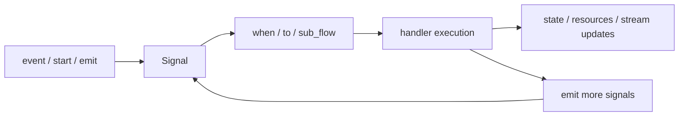

# TriggerFlow Overview

TriggerFlow is not “a more complicated request call”. It is Agently's workflow layer for **explicit stages, concurrency, waiting, resume, and runtime events**.

## When to read this

- Your problem no longer fits one request
- You need stages, branches, concurrency, or wait/resume
- You want the workflow itself to be observable, testable, and reviewable

## What you will learn

- When to upgrade into TriggerFlow
- The signal-driven mental model behind TriggerFlow
- How blueprint, execution, and runtime state relate to each other

> [!TIP]
> Real TriggerFlow practice should default to **Async First**: prefer async chunks, `async_start(...)`, `get_async_runtime_stream(...)`, and `response.get_async_generator(type="instant")` inside chunks when model work needs structured streaming.

## When you should upgrade

If your problem already has these traits, stop forcing it into one request:

- the same task runs through several explicit stages
- you need conditional routing or branching
- you need concurrency across several items
- you need to pause and continue after external input
- you need runtime stream or execution save/load

## TriggerFlow mental model



## Minimal example

```python
from agently import TriggerFlow, TriggerFlowRuntimeData

flow = TriggerFlow()

@flow.chunk("normalize")
async def normalize(data: TriggerFlowRuntimeData):
    return str(data.value).strip()

@flow.chunk("greet")
async def greet(data: TriggerFlowRuntimeData):
    return f"Hello, {data.value}"

flow.to(normalize).to(greet).end()
print(flow.start(" Agently "))
```

The example above keeps a sync entry on purpose so the structure stays easy to read. As soon as this becomes a real service or observable workflow, the recommended upgrade is:

- async chunk handlers
- `execution.async_start(...)`
- `execution.get_async_runtime_stream(...)`
- `response.get_async_generator(type="instant")` for model steps

## Recommended reading order

1. [Concepts](/en/triggerflow/concepts)
2. [Basic Flow](/en/triggerflow/basic)
3. [Events and Signals](/en/triggerflow/events)
4. [Data and Resources](/en/triggerflow/data)
5. [Runtime Stream](/en/triggerflow/runtime-stream)
6. [From Token Output to Live Signals](/en/triggerflow/token-to-signal)
7. [Blueprint](/en/triggerflow/blueprint)

## Common mistakes

- Assuming you need TriggerFlow when the real problem is only unstable output control
- Treating TriggerFlow like a static DAG instead of a signal-driven runtime
- Designing nodes and shared state before clarifying the workflow owner layer

## Next

- Re-check whether you truly need orchestration: [Capability Map](/en/capability-map)
- See a real example: [TriggerFlow Orchestration Playbook](/en/agent-systems/triggerflow-orchestration)
- Follow the recommended production path: [Async First](/en/async-support)

## Related Skills

- `agently-triggerflow`
- `agently-playbook`
