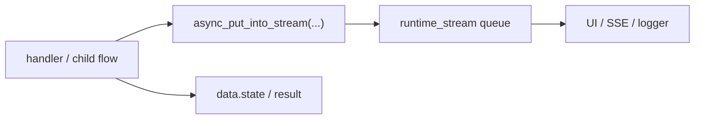
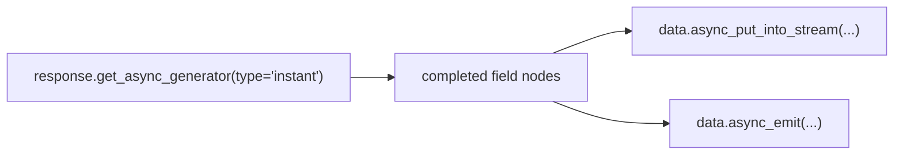

# Runtime Stream and Side-channel Output

`runtime_stream` is not business state and not the final result. Its job is to make long-running workflows observable while they are still executing.

## When to read this

- You want to push TriggerFlow intermediate states into UI, SSE, logs, or external consumers
- You already use async chunks and want to forward model-stream output outward
- You need a clear boundary between `runtime_stream`, `state`, and `result`

## What you will learn

- Why `runtime_stream` is an observability channel rather than a data store
- Why `async_put_into_stream(...)` and `get_async_runtime_stream(...)` are the preferred production path
- How runtime stream works with `instant` structured streaming and `async_emit(...)`

## Runtime stream pipeline



## Recommended rule

- intermediate state display -> `runtime_stream`
- recoverable workflow state -> `data.state`
- final business output -> `result`

Sync APIs still fit demos and local scripts. Real services should default to the async forms.

## Minimal example

```python
from agently import TriggerFlow, TriggerFlowRuntimeData

flow = TriggerFlow()


@flow.chunk("stream_steps")
async def stream_steps(data: TriggerFlowRuntimeData):
    await data.async_put_into_stream({"step": 1})
    await data.async_put_into_stream({"step": 2})
    await data.async_stop_stream()
    return "done"


flow.to(stream_steps)
```

Consumer side:

```python
execution = flow.create_execution()

async for event in execution.get_async_runtime_stream("start", timeout=None):
    print(event)
```

## Combining it with `instant`



This is the highest-value real-time chain:

- `instant` exposes structured nodes
- chunks push useful nodes into `runtime_stream`
- chunks emit business events only for nodes that should trigger more work

## Child-flow stream bridging

By default, child execution runtime-stream items are bridged into the parent execution stream.

That means:

- UIs usually only need to watch the parent execution
- child side-channel events do not disappear by default

But this only improves observability. It does not synchronize parent and child state.

## Timeout and stop

- `timeout` controls how long the consumer waits for new events
- `async_stop_stream()` stops the stream, not the execution itself

## Common mistakes

- Treating `runtime_stream` as final data synchronization
- Using sync `get_runtime_stream(...)` inside an async service by default
- Forwarding raw token noise directly instead of first turning it into structured or business-level events

## Next

- Turn `instant` into business signals: [From Token Output to Live Signals](/en/triggerflow/token-to-signal)
- Structured field streaming basics: [Instant Structured Streaming](/en/output-control/instant-streaming)
- TriggerFlow positioning: [TriggerFlow Overview](/en/triggerflow/overview)

## Related Skills

- `agently-triggerflow-interrupts-and-stream`
- `agently-triggerflow-model-integration`
