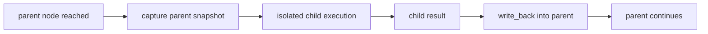

# sub_flow

> Applies to: `v4.0.8.3`

`sub_flow` should not be understood as “automatic inheritance of parent context”. It is an **isolated composable child flow node** inside the parent flow.

## 1. Core mental model



### How to read this diagram

- `capture` happens when the parent execution reaches this node.
- the child receives a one-time snapshot, not a live binding
- `write_back` happens only after the child flow completes successfully

## 2. Public API

```python
parent.to_sub_flow(
    child_flow,
    capture={
        "input": "value",
        "runtime_data": {
            "draft": "runtime_data.draft",
        },
        "flow_data": {
            "locale": "flow_data.locale",
        },
        "resources": {
            "logger": "resources.logger",
        },
    },
    write_back={
        "value": "result.summary",
        "runtime_data": {
            "child_report": "result",
        },
        "flow_data": {
            "last_topic": "result.topic",
        },
    },
)
```

You can also compose a child flow directly:

```python
parent.to(child_flow)
```

This means:

- parent `value` becomes child input
- child `result` becomes parent `value`

## 3. `capture` semantics

Allowed target scopes:

- `input`
- `runtime_data`
- `flow_data`
- `resources`

Allowed source roots:

- `value`
- `runtime_data.*`
- `flow_data.*`
- `resources.*`

Key boundaries:

- only captures the current directly visible parent context
- captures once when the node executes
- does not traverse ancestors
- does not write back automatically

## 4. `write_back` semantics

Allowed target scopes:

- `value`
- `runtime_data`
- `flow_data`

Allowed source roots:

- `result`
- `result.*`

Key boundaries:

- reads only from the final child `result`
- does not expose child internal `runtime_data` or `flow_data` directly
- does not support writing resources back into the parent

## 5. Isolation model

In `v4.0.8.3`, child-flow execution is isolated:

- each invocation gets its own child-flow instance
- child `flow_state` does not leak into the next invocation
- child mutations do not implicitly change parent state
- data exchange is explicit through `capture` and `write_back`

That makes `sub_flow` much closer to a composable function-like node than a shared nested scope.

## 6. Runtime stream behavior

By default, child execution runtime stream events are bridged into the parent execution runtime stream.

That means:

- `put_into_stream(...)` inside the child is visible to parent stream consumers
- one parent stream can represent the full execution chain

But note:

- stream is for observability, not recoverable state
- stream bridging does not replace `write_back`

## 7. Mermaid and export behavior

`to_mermaid()` now renders `sub_flow` as:

- a dashed, tinted child-flow box
- with the complete child structure inlined inside
- while nested `if_condition` / `for_each` blocks remain expanded

This lets one diagram show:

- the parent main chain
- the child internal structure
- the child internal branching and looping shape

## 8. Current limitation

- if the child flow enters `pause_for()`, it is not yet resumed through the parent `sub_flow`
- this currently raises explicitly instead of hanging silently

If you need human interrupts or cross-request resumption, keep that boundary at the parent flow level for now.

## 9. Example references

Recommended source examples:

- `examples/step_by_step/11-triggerflow-18_sub_flow_capture_write_back.py`
- `examples/trigger_flow/sub_flow_capture_write_back.py`
