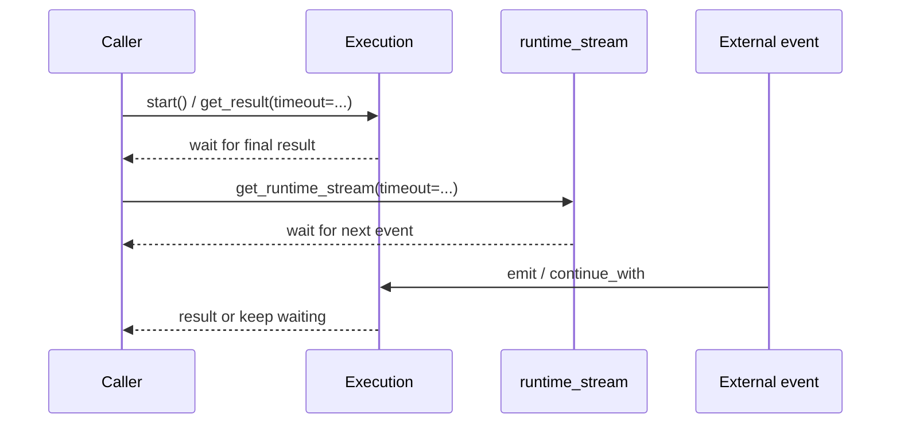

# Timeout and Waiting Strategy

> Visualization boundary: timeout diagrams explain waiting boundaries, not static flow structure.

TriggerFlow is an event-driven runtime. A call to `start()` is not guaranteed to produce a result immediately.

## 1. Timeout timeline

### How to read this diagram

- `get_result(timeout=...)` and `get_runtime_stream(timeout=...)` are separate waiting paths.
- A stream timeout only stops side-channel consumption. It does not terminate execution.

## 2. Common waiting sources

- `when()` waiting for external events
- `pause_for()` waiting for `continue_with()`
- runtime stream waiting for new events or `stop_stream()`

## 3. `get_result(timeout=...)`

When `execution.get_result(timeout=...)` or `flow.start(timeout=...)` times out, it returns `None` and emits a warning.

That usually means:

- there is no final result yet
- you may have forgotten `.end()` or `set_result()`

## 4. Stream timeout

`get_runtime_stream(timeout=...)` timing out only stops stream consumption. It does not end the execution.

## 5. API boundary guidance

- always define explicit timeouts at web/API boundaries
- use `start_execution(..., wait_for_result=False)` for long tasks
- do not encode “wait forever” inside business chunks

## 6. Recommended usage

- linear flows: direct `start()`
- long-lived flows: `start_execution()` plus external waiting
- UI intermediate states: `runtime_stream`
