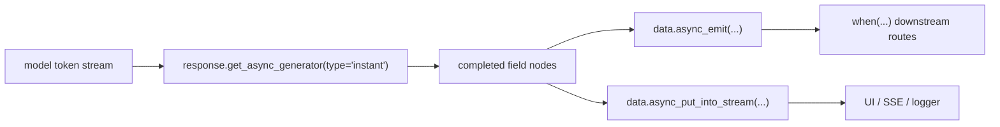

# From Token Output to Live Signals

This page explains one of the highest-value engineering chains in Agently today: **`response.get_async_generator(type="instant")` exposes structured fields early, then TriggerFlow turns them into controlled events and runtime stream output.**

## When to read this

- You already use structured streaming
- Some fields become valuable before the full answer is finished
- You want to route model output into TriggerFlow branches or runtime-stream observers

## What you will learn

- Why `instant` is a better TriggerFlow source than raw token deltas
- How `async_emit(...)` turns completed fields into business signals
- How to write useful intermediate state into `runtime_stream`

## Core chain



The key point is this: not every token deserves to become a business event. `instant` first turns raw generation into structured nodes, then TriggerFlow decides what matters.

## Why `instant` instead of `delta`

- `instant` gives field-level or list-item-level structured nodes
- it is easier to match on `path` and `wildcard_path`
- it is safer to dispatch downstream work only when `is_complete=True`

`delta` still matters, but it is better for:

- typewriter-style UI
- lightweight logs
- cheap status updates

## Recommended pattern

1. define the output schema with `output()`
2. fix one `response = request.get_response()` inside an async chunk
3. consume `async for item in response.get_async_generator(type="instant")`
4. dispatch only when `item.is_complete`
5. separate two exits

- more workflow should continue -> `await data.async_emit(...)`
- only external observers need it -> `await data.async_put_into_stream(...)`

## Minimal example

```python
from agently import Agently, TriggerFlow, TriggerFlowRuntimeData

agent = Agently.create_agent()
flow = TriggerFlow()


@flow.chunk("plan")
async def plan(data: TriggerFlowRuntimeData):
    response = (
        agent
        .input(f"Generate a title and task list for topic {data.value}")
        .output(
            {
                "title": (str, "Title"),
                "tasks": [
                    {
                        "task": (str, "Task content"),
                        "owner": (str, "Owner"),
                    }
                ],
            }
        )
        .get_response()
    )

    async for item in response.get_async_generator(type="instant"):
        if not item.is_complete:
            continue

        if item.path == "title":
            await data.async_put_into_stream({"stage": "title_ready", "title": item.value})

        if item.wildcard_path == "tasks[*]":
            await data.async_emit("TaskReady", item.value)
            await data.async_put_into_stream({"stage": "task_ready", "task": item.value})

    return await response.async_get_data()


@flow.chunk("handle_task")
async def handle_task(data: TriggerFlowRuntimeData):
    return {"accepted": True, "task": data.value}


flow.to(plan)
flow.when("TaskReady").to(handle_task)
```

## Why this pattern is high-value

- one model request can feed UI, logs, and downstream workflow branches
- you do not need to wait for the full result before dispatching bounded work
- TriggerFlow keeps follow-up work explicit with `when(...)` instead of hiding it inside a stream loop

## Critical boundaries

- `instant` does not create more model requests by itself
- do not dispatch heavy work from every tiny partial token
- before `item.is_complete`, most partial fragments are display-level signals, not business-level triggers

## Common mistakes

- treating raw token stream as a business protocol
- spawning unbounded downstream work from the `instant` loop
- emitting business events but forgetting to write useful intermediate state into `runtime_stream`

## Next

- Side-channel observability: [Runtime Stream and Side-channel Output](/en/triggerflow/runtime-stream)
- Core `instant` usage: [Instant Structured Streaming](/en/output-control/instant-streaming)
- TriggerFlow positioning: [TriggerFlow Overview](/en/triggerflow/overview)

## Related Skills

- `agently-triggerflow-model-integration`
- `agently-triggerflow`
- `agently-output-control`
