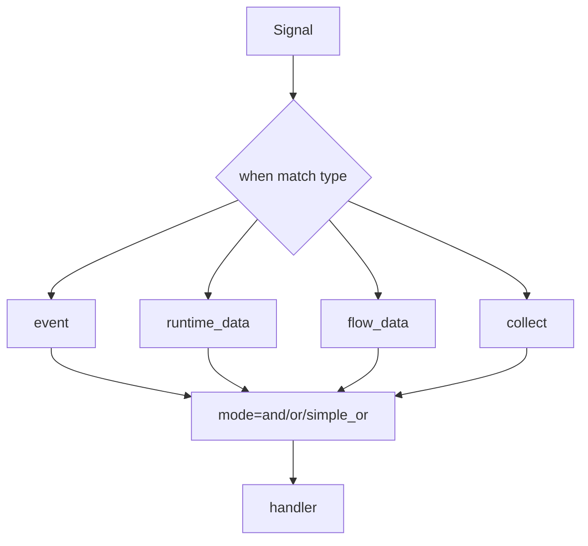

# when Branching and Signal Aggregation

> Visualization boundary: Mermaid helps explain routing, while exported config still depends on named conditions and stable event names.

`when()` means “start this branch when the specified signal arrives”.

## 1. Routing and aggregation map



### How to read this diagram

- `when()` first decides which signal family to listen to, then which aggregation mode to use.
- `and`, `or`, and `simple_or` are not different APIs. They are different semantics on the same `when()`.

## 2. Listen to business events

```python
flow.when("UserFeedback").to(finalize).end()
```

## 3. Listen to state changes

```python
flow.when({"runtime_data": "profile"}).to(handle_profile)
flow.when({"flow_data": "feature_flag"}).to(handle_flag)
```

## 4. Listen to collect results

`.collect("plan", "read")` emits the internal aggregation event:

- `Collect-plan`

So you can also write:

```python
flow.when({"collect": "plan"}).to(handle_collected_plan)
```

## 5. Multi-signal modes

### `mode="and"`

Continue only when all signals arrive:

```python
flow.when({"event": ["A", "B"]}, mode="and").to(after_both)
```

### `mode="or"`

Continue on the first arrival and pass `(type, event, value)`:

```python
flow.when({"event": ["A", "B"]}, mode="or").to(handle_first)
```

### `mode="simple_or"`

Continue on the first arrival and pass only `value`:

```python
flow.when({"event": ["A", "B"]}, mode="simple_or").to(handle_value_only)
```

## 6. Current best practices

- external systems should listen to business event names, not internal chunk triggers
- if a `when()` branch is supposed to produce the final result, end it explicitly with `.end()` or `set_result()`
- use `and` only when you truly need all prerequisites present
