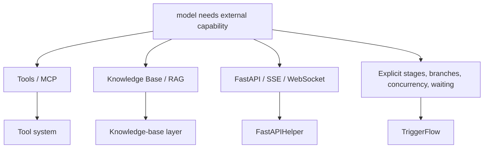

# Workflow and Extensions Overview

This chapter starts when your application touches the outside world, or when the control flow itself becomes more complex.

> [!TIP]
> From this chapter onward, the recommended default is **Async First**. Tool streaming, `instant` structured output, FastAPI service exposure, and TriggerFlow `runtime_stream` plus `async_emit(...)` all fit async interfaces better.

## When to read this

- The model needs tools, search, browser access, commands, or an MCP server
- You want to expose Agently as a web service
- You need a knowledge base or RAG
- You now have explicit stages, branching, concurrency, or wait/resume logic

## What you will learn

- Which problems belong to extensions and which already belong to workflow orchestration
- What Tools, MCP, KB, FastAPI, and TriggerFlow each solve
- How to upgrade from the request side without over-designing too early

## Selection map

## Reading by problem type

### Tools

Good fit:

- search, browser, command execution
- tool logs and tool-loop control

Entry:

- [Tool System Overview](/en/agent-extensions/tools)

### MCP

Good fit:

- connecting an existing MCP server directly into Agently

Entry:

- [MCP Integration](/en/agent-extensions/mcp)

### Knowledge Base / RAG

Good fit:

- document retrieval, knowledge QA, source-backed answers

Entry:

- [Knowledge Base / RAG](/en/knowledge-base/overview)

### FastAPI

Good fit:

- exposing HTTP, SSE, or WebSocket APIs

Entry:

- [FastAPIHelper Integration](/en/agent-extensions/fastapi-helper)

### TriggerFlow

Good fit:

- multi-stage execution
- branches and concurrency
- runtime stream
- wait, resume, and execution save/load
- consuming model results inside async chunks and routing them further

Entry:

- [TriggerFlow Overview](/en/triggerflow/overview)
- [Async First](/en/async-support)

## Common mistakes

- Building a whole workflow when all you needed was one external API call
- Mixing retrieval output directly into prompts and business logic before clarifying ownership
- Reinventing a streaming protocol before checking FastAPIHelper and TriggerFlow runtime stream

## Next

- Tools first: [Tool System Overview](/en/agent-extensions/tools)
- Knowledge base first: [Knowledge Base / RAG](/en/knowledge-base/overview)
- Confirm you have outgrown the request side: [TriggerFlow Overview](/en/triggerflow/overview)
- Use the recommended production path: [Async First](/en/async-support)

## Related Skills

- `agently-agent-extensions`
- `agently-knowledge-base`
- `agently-triggerflow`
